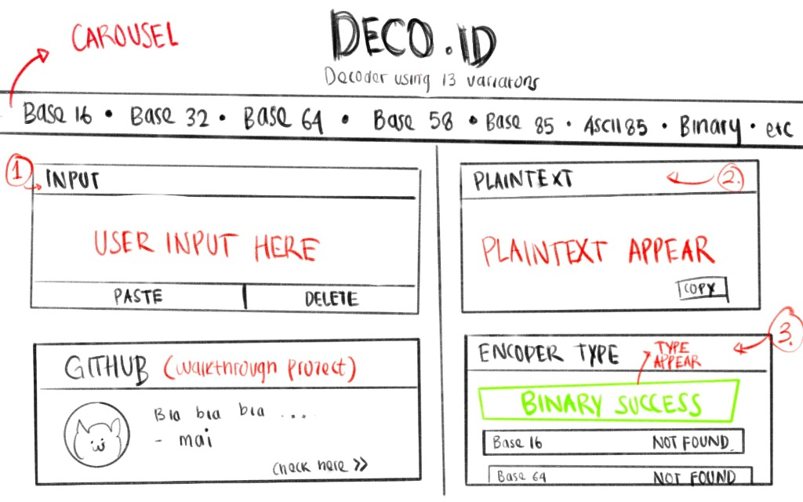

# DECO.ID - Universal Decoder

DECO.ID is a web-based decoder application designed to translate (decode) encoded or encrypted text using 13 decoding schemes. The application features a readability scoring mechanism to automatically filter and rank the most suitable decoding results.

---

## Key Features

DECO.ID supports 13 decoding schemes, including Base64, Base16 (Hex), Base32, Base58, Base85, ASCII85, Morse Code, Binary, Octal, Decimal, Unicode Escape, HTML Entities, and URL Encode. To assist users, the application features an automatic readability scoring mechanism that ranks the most legible text results based on the proportion of letters, numbers, spaces, and common words. The application also provides real-time interaction, processing inputs as you type, complete with quick-action buttons to copy, paste, and delete text.

---

## CLI Logic 

The core decoding logic is implemented in [func.py](func.py), which contains individual decoder functions for each of the 13 supported schemes using Python's built-in modules (`base64`, `urllib.parse`, `html`) along with the `base58` package. A command-line interface (CLI) is included to test and verify the functionality and accuracy of each decoder function directly from the terminal.

---

## Website Implementation 
The application is served as a web API using Flask in [api/index.py](api/index.py). The server exposes a POST endpoint at `/api/decode-all` to run inputs through the 13 decoders and apply the readability scoring function. On the frontend, [static/app.js](static/app.js) captures text input in real-time and fetches the decoded results asynchronously. The web server is configured for serverless deployment on Vercel using [vercel.json](vercel.json) and lists its requirements in [requirements.txt](requirements.txt).

---

## UI Design 

  

The user interface is structured in [templates/index.html](templates/index.html) and styled with [static/style.css](static/style.css). It features a clean, two-column layout that positions the input field on the left and the decoded plaintext results and decoder status bubbles on the right. This establishes a modern, distraction-free, and user-friendly experience.

---
